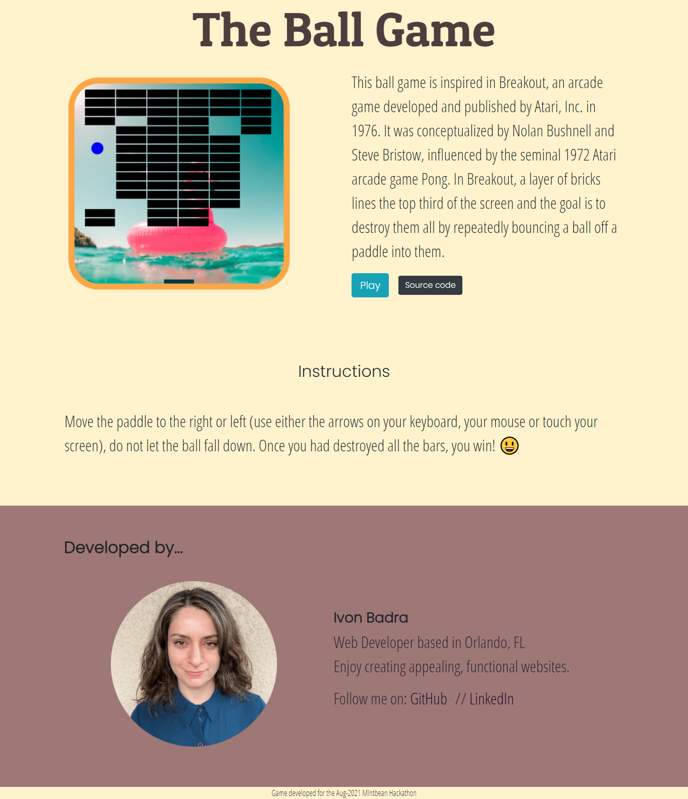
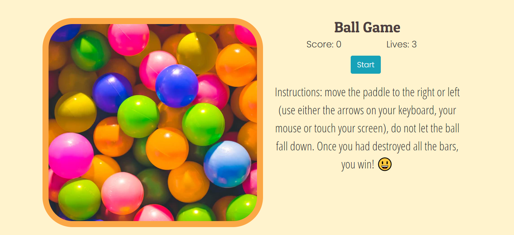

# The Ball Game

My first Hackathon experience! This game was developed for the August 2021 Mintbean Hackathon. It is based in Breakout, an arcade game developed and published by Atari, Inc. in 1976. HTML5's Canvas was used to set the area and draw the game and the logic was coded with JavaScript. [Play the game!](https://theballgame.netlify.app/)🎮

\
&nbsp;

## Instructions:

Move the paddle to the right or left (use either the arrows on your keyboard, your mouse or touch your screen), do not let the ball fall down. Once you had destroyed all the bars, you win! 😃

\
&nbsp;

## Technologies used:

\
&nbsp;

\
&nbsp;

\
&nbsp;

## Features:

It has a landing page explaining the game, the instructions and presenting myself as the developer.
The game counts with music, random and colorful background images, a modern UI display, a score and lives counter, and a start button.

\
&nbsp;

## Would you like to play? Visit [The Ball Game](https://theballgame.netlify.app/) website 🎮

